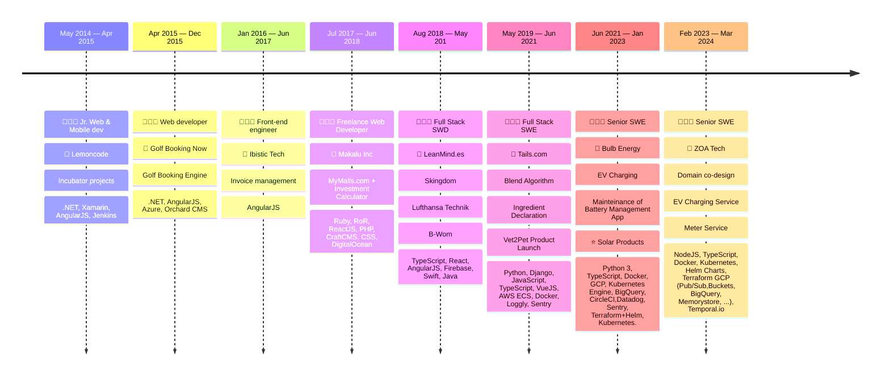

### Hi there 👋

- 🌎 I'm extremely passionate about Climate Tech.
- 👩🏻‍🔬 I'm currently on a career break working on my knowledge and skills, reflecting on my past jobs and preparing for my next role.
- 👯 I’m looking to collaborate with useful open source projects. 
- 💬 Ask me about any of the above.
- ⚡ Fun fact: My 2025 physical skills goal is to be able to walk on my hands 🤸🏻‍♀️, if you have tips I'm all ears.

A visual representation of my career so far:

